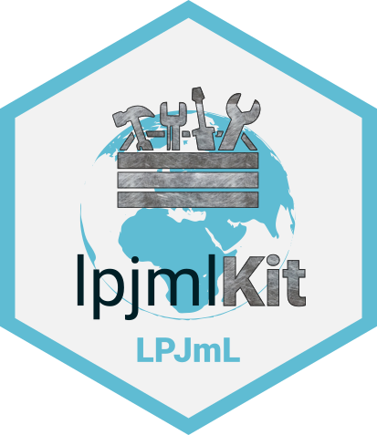

# <a href=''></a> Toolkit for Basic LPJmL Handling

R package **lpjmlkit**, version **1.7.6**

[](https://cran.r-project.org/package=lpjmlkit) [](https://doi.org/10.5281/zenodo.7773134) [](https://github.com/PIK-LPJmL/lpjmlkit/actions) [](https://app.codecov.io/gh/PIK-LPJmL/lpjmlkit) [](https://pik-piam.r-universe.dev/builds)

## Purpose and Functionality

A collection of basic functions to facilitate the work with the
    Dynamic Global Vegetation Model (DGVM) Lund-Potsdam-Jena managed Land
    (LPJmL) hosted at the Potsdam Institute for Climate Impact Research (PIK).
    It provides functions for performing LPJmL simulations, as well as reading,
    processing and writing model-related data such as inputs and outputs or
    configuration files.
## Overview

### **LPJmL Runner &#127939;**  to perform LPJmL simulations
   *LPJmL Runner only supports Unix-based operating systems that have an LPJmL version >= 4 installed.*
- &#9997; `write_config()` write config.json files using a data frame with parameters to be changed and a base configuration file
- &#128269; `check_config()` check if generated config.json files are valid for LPJmL simulations
- &#9654; `run_lpjml()` run LPJmL directly (e.g. single cell simulations) or &#128640; `submit_lpjml()` to SLURM (e.g. global simulations)


### **LPJmL Data &#128190;** for reading and processing LPJmL data
- `read_io()` read LPJmL input and output as a `LPJmLData` object, containing the data array and LPJmLMetaData
    - &#128200; `plot()` the data or get insights via `summary()` and other base stats
    - &#128257; `transform()` it to other time and space formats
    - &#9986; `subset()` the underlying data
    - &#128230; `as_array()`, `as_tibble()` and `as_raster()` / `as_terra()` to export into common R data formats

- `read_meta()` read meta or header files as `LPJmLMetaData` object

### **miscellaneous**
- `calc_cellarea()` to calculate the area of LPJmLData objects underlying grid
or for other objects latitudes
- functions to handle LPJmL file headers, `read_header()` read the header of LPJmL files, `get_headersize()` get the size of a file header or `create_header()` to create a header object for writing input files
- `get_datatype()` get information on the data type used in different LPJmL files
- `asub()` functionality of the subset method to be used on a base array, also to replace data
- ... *more functions via `library(help = "lpjmlkit")`*

## Installation

For installation of the most recent package version an additional repository has to be added in R:

```r
options(repos = c(CRAN = "@CRAN@", pik = "https://rse.pik-potsdam.de/r/packages"))
```
The additional repository can be made available permanently by adding the line above to a file called `.Rprofile` stored in the home folder of your system (`Sys.glob("~")` in R returns the home directory).

After that the most recent version of the package can be installed using `install.packages`:

```r 
install.packages("lpjmlkit")
```

Package updates can be installed using `update.packages` (make sure that the additional repository has been added before running that command):

```r 
update.packages()
```

## Tutorial

The package comes with vignettes describing the basic functionality of the package and how to use it. You can load them with the following command (the package needs to be installed):

```r
vignette("lpjml-data")   # LPJmL Data
vignette("lpjml-runner") # LPJmL Runner
```

## Questions / Problems

In case of questions / problems please contact Jannes Breier <jannesbr@pik-potsdam.de>.

## Citation

To cite package **lpjmlkit** in publications use:

Breier J, Ostberg S, Wirth S, Minoli S, Stenzel F, Hötten D, Müller C (2025). "lpjmlkit: Toolkit for Basic LPJmL Handling." doi:10.5281/zenodo.7773134 <https://doi.org/10.5281/zenodo.7773134>, Version: 1.7.6, <https://github.com/PIK-LPJmL/lpjmlkit>.

A BibTeX entry for LaTeX users is

 ```latex
@Misc{,
  title = {lpjmlkit: Toolkit for Basic LPJmL Handling},
  author = {Jannes Breier and Sebastian Ostberg and Stephen Björn Wirth and Sara Minoli and Fabian Stenzel and David Hötten and Christoph Müller},
  doi = {10.5281/zenodo.7773134},
  date = {2025-01-27},
  year = {2025},
  url = {https://github.com/PIK-LPJmL/lpjmlkit},
  note = {Version: 1.7.6},
}
```
