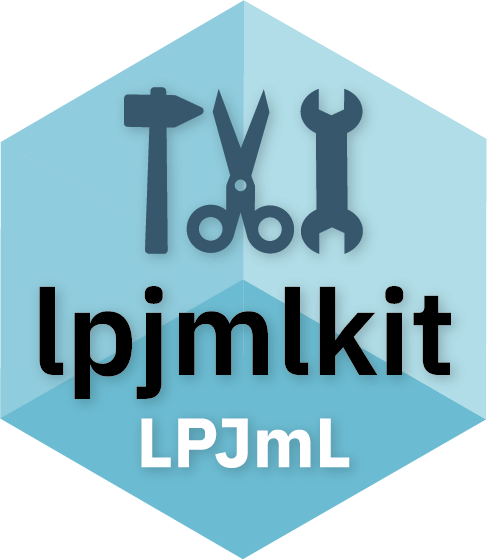

# Summary

{width=24% align=left}

The *lpjmlkit* R package [@lpjmlkit_manual] is an open source software that is
developed for handling the open source dynamic global vegetation model (DGVM)
[LPJmL](https://github.com/PIK-LPJmL/LPJmL).
It contains two main modules.
One, *LPJmL Runner*, provides the functionality to create multiple model
configurations and start the corresponding simulations either on a personal
computer or on an HPC (High Perfomance Computing) cluster with SLURM
(Simple Linux Utility for Resource Management) support, in both cases requiring
a working LPJmL installation.
The other, *LPJmL Data*, offers a generic function that supports reading both
simulation output and model input data in multiple file formats used by LPJmL.
The associated data class LPJmLData contains both the data and the
corresponding metadata to ensure data integrity within a single instance.
LPJmLData objects act as data containers that provide modification functions
such as subsetting or transformations of the data.
LPJmLData objects can be exported into various other common R data formats.
In addition to these modules, other functions are included to facilitate common
use cases of LPJmL.
This article introduces *lpjmlkit*, an R package that serves as an interface to
LPJmL to simplify direct work with the model and to enable new generic software
developments based on LPJmL simulations or data.

# Statement of need

A simple interface facilitates the use of software and improves accessibility,
user experience, and overall adoption.
Scientific software should also be findable, accessible, interoperable and
reusable, according to the FAIR principles for research software
[@barker_introducing_2022].

Numerical models based on process-based approaches and implemented in low-level
programming languages are often characterised by a long history and long
development cycles, that affect operability.
These models therefore often lack simple and reliable interfaces that are also
FAIR [@wilson_best_2014; @barker_introducing_2022].
LPJmL is a well-established dynamic global vegetation,
hydrological and crop model, widely used in the scientific community.

LPJmL has been used for more than a decade and was employed by researchers
to conduct numerous studies in various research areas related to the
terrestrial biosphere.
To this end, the original DGVM LPJ [@Sitch2003] was extended by adding an
improved representation of the hydrological cycle [@gerten_terrestrial_2004],
by implementing managed land components, forming "LPJmL"
(LPJ with *m*anaged *L*and)) [@bondeau_modelling_2007; @rolinski_modeling_2018;
@lutz2019simulating; @schaphoff_lpjml4_2018], and by including the nitrogen 
cycle [@von_bloh_implementing_2018].
This facilitated broader, interdisciplinary studies such as the work of
@gerten_feeding_2020, which answered the question of whether it is possible to
feed ten billion people within four planetary boundaries, or studies that
implemented features of sustainable agriculture in LPJmL
[@Porwollik2022cover; @Herzfeld2021soc] that had not been simulated before
within a DGVM.
There are many other examples of different scientific studies based on LPJmL
simulations, all using individual scripts to create inputs for the model or
analyze outputs.

Unlike its sister model LPJ-GUESS [@bagnara_r_2019] or other models, such as
MAgPIE [@dietrich_magpie_2019], LPJmL was never equipped with standardised
interfaces for higher level programming languages to either run simulations or
read and process input or output data.
The lack of a standardized interface means that both beginners and experienced
users need to constantly develop their own custom scripts and tools for what
should be routine (data) processing steps.
Tools shared informally between individual users often have limited scope and as
such limited re-usability.
They lack documentation and are often not well tested or maintained, nor
released to a wide user base in a transparent manner.

*lpjmlkit* was developed to address these problems and at the same time create
a standard in the handling of LPJmL to improve the management of simulation
experiments and allow for better documentation and reproducibility of studies
with LPJmL.
By using the *LPJmL Runner* functionality, model configurations are stored in a
single and unique configuration file that references the exact model version of
LPJmL used for the simulations to achieve reproducible results.
*LPJmL Data* subsequently ensures a generic standard for version-independent
processing of LPJmL (output) data.
This way, *lpjmlkit* serves as a user and programming interface to LPJmL and
provides an easy-to-use basis for interaction with LPJmL in a simple R script
as well as for further software development based on LPJmL, for example model
calibration, benchmarking or indicator development.

# Package features

*lpjmlkit*  is an R package that contains two main modules, each of which
contains supplementary documentation in the form of a guide in addition to the
package documentation:
* [*LPJmL Runner* vignette](https://pik-piam.r-universe.dev/articles/lpjmlkit/lpjml-runner.html)
* [*LPJmL Data* vignette](https://pik-piam.r-universe.dev/articles/lpjmlkit/lpjml-data.html)

Together, these modules can be used to set up and
run LPJmL model simulations as well as read and process the resulting data.

## LPJmL Runner

The Runner module is designed to operate LPJmL on Unix-based operating systems
that have a working LPJmL installation and includes four key functions.

- `write_config()` generates JSON configuration files by utilizing a
base configuration file as a source template to be preprocessed prior to use,
along with a data frame containing parameters to be modified. It also sets up
the directory structure and files to execute the runs and collect the outputs.

- `check_config()` tests whether generated config.json files are valid
for LPJmL simulations using LPJmL utility functionality.

- `run_lpjml()` executes LPJmL as a subprocess directly from within
the current R session. This is particularly useful for simulations with a small
number of spatial cells that require few resources.

- `submit_lpjml()` function submits the LPJmL Simulations to SLURM to be run
by an HPC cluster using additional resources and detached from the current
R session, which is necessary for (global) runs that include all or many spatial
cells to be simulated.

```R
library("lpjmlkit")

lpjml_path <- "./LPJmL_internal"
sim_path <- "./simulations"

# Define data frame with configuration parameters to be changed
config_params <- data.frame(
  sim_name = c("spinup", "landuse", "natural_vegetation"),
  landuse = c("no", "yes", "no"),
  reservoir = c(FALSE, TRUE, FALSE),
  river_routing = c(FALSE, TRUE, FALSE),
  wateruse = c("no", "yes", "no"),
  const_deposition = c(FALSE, FALSE, TRUE),
  dependency = c(NA, "spinup", "spinup")
)

# Write corresponding configuration files using a (precompiled) base
# configuration file
config_details <- write_config(config_params,
                               model_path = lpjml_path,
                               sim_path = sim_path)

# Check validity of each written configuration file
check_config(config_details,
             model_path = lpjml_path,
             sim_path = sim_path)

# Submit LPJmL simulations to SLURM on an HPC cluster
submit_lpjml(config_details,
             model_path = lpjml_path,
             sim_path = sim_path)
```

## LPJmL Data

The Data module provides various functions for reading and processing LPJmL
data.

* `read_io()` reads LPJmL input and output data as an `LPJmLData`
object, which contains the data array and corresponding meta data
(`LPJmLMetaData`).

* `LPJmLData` objects can be used for further analysis and visualization, such as
the `plot()`, `summary()`, or other basic statistics functions available.

* users can also `transform()` the data into different space and time
representations that define the array dimensions and `subset()` them explicitly
by using the corresponding dimension names.

* an LPJmLData object can be exported to common R data formats using
`as_array()`, `as_tibble()`, or `as_raster()` / `as_terra()`.

```R
# Read runoff output from the corresponding LPJmL output file 
# (generated by the LPJmL Runner example from above)
runoff <- read_io(filename = "./simulations/output/lu/runoff.bin.json"),
                  subset = list(year = as.character(2010:2019)))

# Transform into required format to be subsetted by months and latitudes and
# plot aggregated years and months by using the pipe operator
runoff |>
  transform(to = c("year_month_day", "lon_lat")) |>
  subset(month = 6:9,
         lat = as.character(seq(0.25, 83.75, by = 0.5))) |>
  plot(aggregate = list(year = mean, month = sum),
       raster_extent = raster::extent(-180, 180, 0, 84),
       main = "Northern hemisphere summer runoff [mm]")
abline(h = 0, lty = 2)
```


Both classes, `LPJmLData` and `LPJmLMetaData` have been implemented using the
R6 class system [@chang_r6_2021], which allows, for example, methods to be
executed directly on the object rather than creating a copy and applying changes
to that copy. This notation also reduces the execution time of the underlying
functionality.

```R
# Same functionality but usage of the underyling R6 class implementation
runoff$transform(to = c("year_month_day", "lon_lat"))
runoff$subset(month = 6:9,
              lat = as.character(seq(0.25, 83.75, by = 0.5)))
runoff$plot(aggregate = list(year = mean, month = sum),
            raster_extent = raster::extent(-180, 180, 0, 84),
            main = "Northern hemisphere summer runoff [mm]")
abline(h = 0, lty = 2)
```

## Miscellaneos

The *lpjmlkit* package also includes additional functions to support different
applications that involve handling LPJmL or related data.

For example, `calc_cellarea()` calculates the area of the grid cells in an
LPJmLData object or for any vector of latitude coordinates representing a
regular grid with a set spatial resolution.

While `read_io` is the main function to access LPJmL input and output files,
`lpjmlkit` also includes a number of functions providing low-level access to the
binary LPJmL file format: `read_header()`, `create_header()`, and
`write_header()` allow to retrieve/generate/save file headers, while
`get_headersize()` and `get_datatype()` return information about the header and
about the data type used in different LPJmL files, respectively.
These low-level access functions can form the basis for new applications, for
example, to generate new LPJmL input files.

Lastly, `asub()` provides the functionality of the subset method to be used on
a base array.


# Documentation & License

*lpjmlkit* is an open-source software package for operating LPJmL and processing
related data that provides comprehensive documentation and vignettes.
The documentation is available online at
[https://pik-piam.r-universe.dev/lpjmlkit](https://pik-piam.r-universe.dev/lpjmlkit)
and includes instructions for installation, usage, and examples.
The package is licensed under the GNU Affero General Public License (AGPL-3.0),
which grants users the freedom to access, use, and modify the code, and ensures
that any modifications or derivative works are also available under the same
license, allowing for continued collaboration and development within the
community.
The source code is available on GitHub at
[https://github.com/PIK-LPJmL/lpjmlkit](https://github.com/PIK-LPJmL/lpjmlkit),
where users can also report issues and suggest improvements.

# Acknowledgements

We would like to thank Pascal Führlich and Jan Philipp Dietrich for providing
access to PIK Research Software Engineering resources and additional support
during the development process.
Special thanks also go to Werner von Bloh for implementing new features into
LPJmL to enable the development of lpjmlkit, such as writing meta
files.
Further thanks go to Susanne Rolinski and Marie Hemmen who supported the project
along the way.

# References
