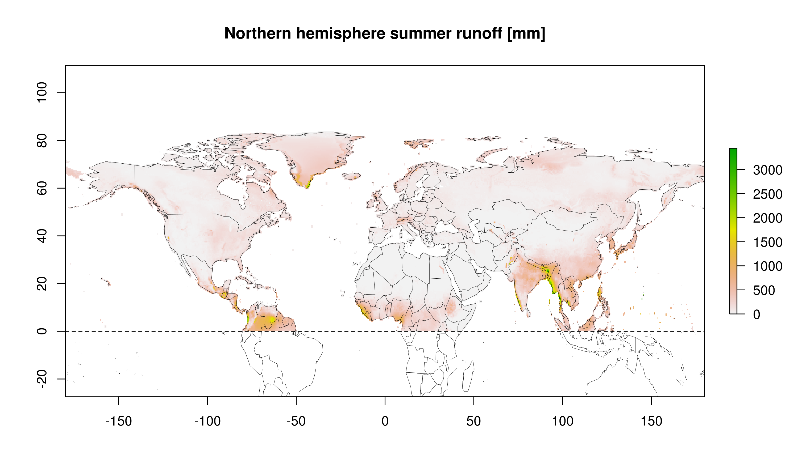

# Summary

{width=24% align=left}

The *lpjmlkit* R package [@lpjmlkit_manual] is an open source software that is
developed for handling the open source dynamic global vegetation model (DGVM)
[LPJmL](https://github.com/PIK-LPJmL/LPJmL).
It contains two main modules.
One, *LPJmL Runner*, provides the functionality to create multiple model
configurations and start the corresponding simulations either on a personal
computer or on an HPC (High Perfomance Computing) cluster with SLURM
(Simple Linux Utility for Resource Management) support, in both cases requiring
a working LPJmL installation.
The other, *LPJmL Data*, offers a generic function that supports reading both
simulation output and model input data in multiple file formats used by LPJmL.
The associated data class LPJmLData contains both the data and the
corresponding metadata to ensure data integrity within a single instance.
LPJmLData objects act as data containers that provide modification functions
such as subsetting or transformations of the data.
LPJmLData objects can be exported into various other common R data formats.
In addition to these modules, other functions are included to facilitate common
use cases of LPJmL.
This article introduces *lpjmlkit*, an R package that serves as an interface to
LPJmL to simplify direct work with the model and to enable new generic software
developments based on LPJmL simulations or data.

# Statement of need

A simple interface facilitates the use of software and improves accessibility,
user experience, and overall adoption.
Scientific software should also be findable, accessible, interoperable and
reusable, according to the FAIR principles for research software
[@barker_introducing_2022].
Numerical models based on process-based approaches and implemented in low-level
programming languages are often characterised by a long history and long
development cycles, that affect operability.
These models therefore often lack simple and reliable interfaces that are also
FAIR [@wilson_best_2014; @barker_introducing_2022].
LPJmL is a well-established dynamic global vegetation model (DGVM), widely used
in the scientific community.
A DGVM simulates potential vegetation shifts and associated biogeochemical and
hydrological cycles in response to changes in climate. [@cramer_global_2001]
DGVMs are typically used to simulate the effects of future climate change on
natural vegetation and its carbon and water cycles.
In this context LPJmL has been used for more than a decade and was employed by
researchers to conduct numerous studies in various research areas related to the
terrestrial biosphere.
To this end, the original DGVM LPJ [@Sitch2003] was extended by adding an
improved representation of the hydrological cycle [@gerten_terrestrial_2004],
by implementing managed land components, forming "LPJmL"
(LPJ with *m*anaged *L*and)) [@bondeau_modelling_2007; @rolinski_modeling_2018;
@lutz2019simulating; @schaphoff_lpjml4_2018], and by including the nitrogen 
cycle [@von_bloh_implementing_2018].
This facilitated broader, interdisciplinary studies such as the work of
@gerten_feeding_2020, which answered the question of whether it is possible to
feed ten billion people within four planetary boundaries, or studies that
implemented features of sustainable agriculture in LPJmL
[@Porwollik2022cover; @Herzfeld2021soc] that had not been simulated before
within a DGVM.
There are many other examples of different scientific studies based on LPJmL
simulations, all using individual scripts to create inputs for the model or
analyze outputs.

Unlike its sister model LPJ-GUESS [@bagnara_r_2019] or other models, such as
MAgPIE [@dietrich_magpie_2019], LPJmL was never equipped with standardised
interfaces for higher level programming languages to either run simulations or
read and process input or output data.
The lack of a standardized interface means that both beginners and experienced
users need to constantly develop their own custom scripts and tools for what
should be routine (data) processing steps.
Tools shared informally between individual users often have limited scope and as
such limited re-usability.
They lack documentation and are often not well tested or maintained, nor
released to a wide user base in a transparent manner.

*lpjmlkit* was developed to address these problems and at the same time create
a standard in the handling of LPJmL to improve the management of simulation
experiments and allow for better documentation and reproducibility of studies
with LPJmL.
By using the *LPJmL Runner* functionality, model configurations are stored in a
single and unique configuration file that references the exact model version of
LPJmL used for the simulations to achieve reproducible results.
*LPJmL Data* subsequently ensures a generic standard for version-independent
processing of LPJmL (output) data.
This way, *lpjmlkit* serves as a user and programming interface to LPJmL and
provides an easy-to-use basis for interaction with LPJmL in a simple R script
as well as for further software development based on LPJmL, for example model
calibration, benchmarking or indicator development.

# Package features

*lpjmlkit*  is an R package that contains two main modules, each of which
contains supplementary documentation in form of a guide in addition to the
package documentation:

* [*LPJmL Runner* vignette](https://pik-piam.r-universe.dev/articles/lpjmlkit/lpjml-runner.html)
* [*LPJmL Data* vignette](https://pik-piam.r-universe.dev/articles/lpjmlkit/lpjml-data.html)

Together, these modules can be used to configure and
run LPJmL model simulations as well as read and process the resulting data.

## LPJmL Runner

The Runner module is designed to operate LPJmL on Unix-based operating systems
that have a working LPJmL installation (version 4 or higher) and includes four
key functions.

The basic idea is to create tables for the parameters
and settings to be changed from a default configuration file
for single runs or any number of related simulations,
e.g. multi-scenario or uncertainty/sensitivity analyses.
The creation of these tables is based on the concept of `tidy data` with columns as
parameters/settings (variables) and rows as simulations (observations)
[@wickham_tidy_2014].
In order to facitlitate the execution of these simulations, the function `write_config()`
handles the formatting of the corresponding `tidy data` tables into LPJmL compatible JSON
configuration files.

LPJmL simulations can either be run sequentially on single CPUs with `run_lpjml()`,
which is particularly suitable for testing the model or for focusing on small
regions.
In addition, simulations can be submitted to an HPC cluster equipped with the
SLURM workload manager using `submit_lpjml()`, which is particularly useful for
computing multiple global simulations in parallel mode using multiple CPUs.

## LPJmL Data

While the module *LPJmL Runner* covers the whole range of running LPJmL simulations, 
`LPJmL Data` provides the tools for the subsequent data analysis part.
LPJmL simulations output data in a raw binary data format designed for memory efficient
data structures.
The LPJmL model can write metadata for each output file, either as a file header or as an
additional metadata file in JSON format.
Using `read_io()`, LPJmL raw output data can be read into a standardised data format called
`LPJmLData`, which makes use of the corresponding metadata
to correctly represent the data arrays (dimensions, units, etc.).

This data format is designed to faciliitate the functionalities commonly used by
LPJmL users for data analysis.
In addition to the descriptive statistics that an LPJmLData object displays by default,
there is a `plot()` method to easily display the the data for visual inspection.
`LPJmLData` objects can be transformed into various common spatial and temporal
formats with the funciton `transform()`.
For example, the one-dimensional cell vector can be transformed into a
longitude-latitude matrix to allow further spatial operations such as "nearest
neighbour" subsetting, using coordinate pairs.
The temporal dimension can be decomposed into further sub-time dimensions,
which is particularly useful for high temporal resolutions such as monthly or
daily data covering several years.
Several export functions allow for easy conversion of the LPJmLData format to 
other common data formats such as `SpatRaster` (`as_terra()`), `tibble`
(`as_tibble()`) or simply `array` (`as_array()`).
Here, in addition to subsetting, the data can also be aggregated using common
functions such as `mean()` or `sum()`.

Especially in combination, these different functions can greatly increases
the utility for data analysis.
For example, a combination of the transformation of the read-in
discharge into sub-time dimensions and latitude-longitude matrix and the
subsequent subsetting of the summer months of the northern hemisphere and the
aggregation over years and months allows the following presentation.

## Miscellaneos

The *lpjmlkit* package also includes additional functions to support different
applications that involve handling LPJmL or related data.

For example, the function `calc_cellarea()` calculates the area of the grid cells in an
`LPJmLData` object or for any vector of latitude coordinates representing a
regular grid with a set spatial resolution.

While `read_io()` is the main function to access LPJmL input and output files,
*lpjmlkit* also includes a number of functions providing low-level access to the
binary LPJmL file format: `read_header()`, `create_header()`, and
`write_header()` allow to retrieve/generate/save file headers, while
`get_headersize()` and `get_datatype()` return information about the header and
about the data type used in different LPJmL files, respectively.
These low-level access functions can form the basis for new applications, for
example, to generate new LPJmL input files.

# Documentation & License

*lpjmlkit* is an open-source software package for operating LPJmL and processing
related data that provides comprehensive documentation and vignettes.
The documentation is available online at
[https://pik-piam.r-universe.dev/lpjmlkit](https://pik-piam.r-universe.dev/lpjmlkit)
and includes instructions for installation, usage, and examples.
The package is licensed under the GNU Affero General Public License (AGPL-3.0),
which grants users the freedom to access, use, and modify the code, and ensures
that any modifications or derivative works are also available under the same
license, allowing for continued collaboration and development within the
community.
The source code is available on GitHub at
[https://github.com/PIK-LPJmL/lpjmlkit](https://github.com/PIK-LPJmL/lpjmlkit),
where users can also report issues and suggest improvements.

# Acknowledgements

We would like to thank Pascal Führlich and Jan Philipp Dietrich for providing
access to PIK Research Software Engineering resources and additional support
during the development process.
Special thanks go to Werner von Bloh for implementing new features into
LPJmL to enable the development of lpjmlkit, such as writing meta
files.
We would also like to thank the Earth4All project for the support that made this development possible.  
Further thanks go to Susanne Rolinski, David Hötten and Marie Hemmen who supported the project
along the way.

# References
